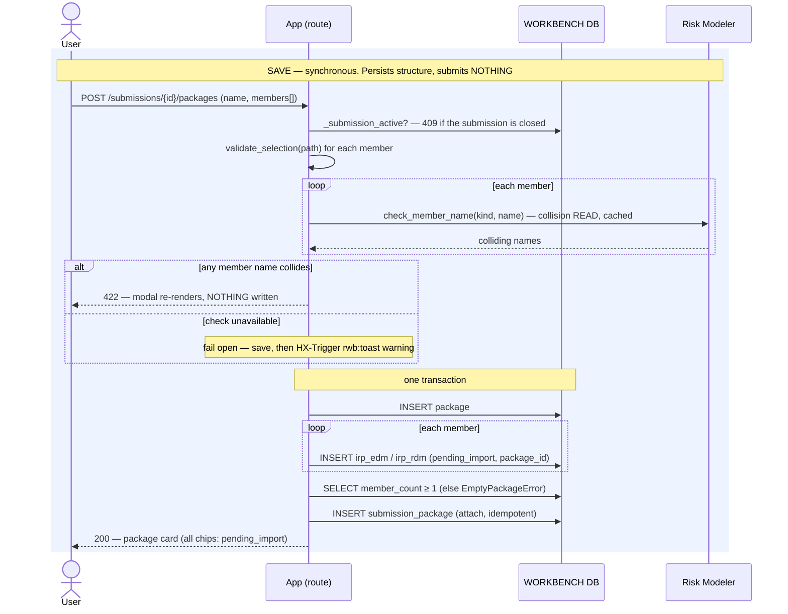
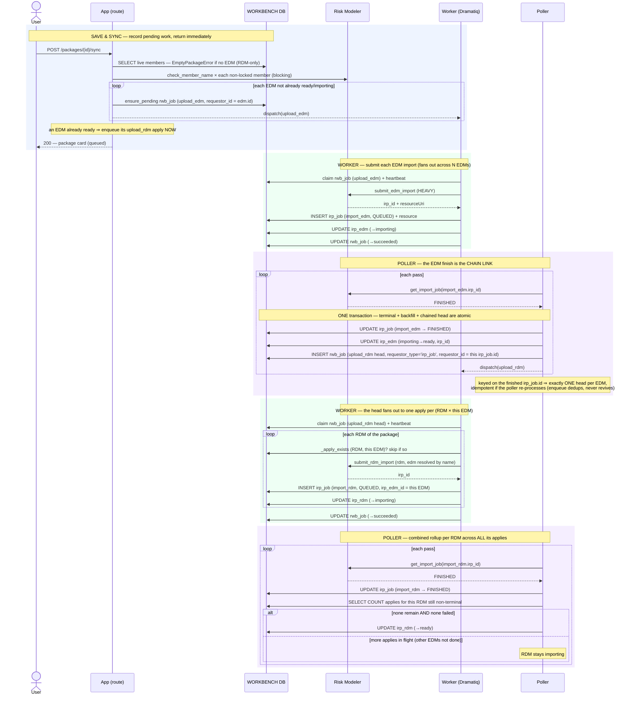

# Execution Flow — Assemble & Sync a Package (US3)

The headline action. The analyst assembles a package (EDMs + RDMs) on the submission
detail, **Saves** it (persists the shell + members, submits nothing), then **Save & Syncs**
(records the pending work and returns). All the Risk Modeler work is carried off-request by
the worker and poller, and the **EDM→RDM chaining is poller-mediated**: each EDM that
finishes importing triggers one `upload_rdm` head that fans out to one apply per RDM of
*that* EDM. For **N EDMs × M RDMs** that is **N heads → N×M applies**.

Code: `package_sync_service.save_package` / `save_and_sync` →
`package_jobs._upload_edm_body` / `_upload_rdm_body` →
`poller.run._handle_import_edm_terminal` (the chain link) → `_handle_import_rdm_terminal`.

**Two request-path operations. Neither submits to Risk Modeler (FR-042):**

- **Save** — per-member collision **check** + `INSERT package` + one member entity per
  EDM/RDM (each `pending_import`) + `INSERT submission_package`. **No `rwb_job`, no RM
  submit.**
- **Save & Sync** — the same, plus one `upload_edm` `rwb_job` per pending EDM (idempotent).
  Returns immediately. Everything after is worker + poller.

**The member name-check blocks** (003 amendment, 2026-07-27), the same three-way outcome as
[import EDM](../entities/import_edm.md) but applied per member via
`name_check.check_member_name(kind, name)`: a real collision raises and **nothing is
written**; an unreachable gateway **fails open**, saving the package and raising an
`HX-Trigger: rwb:toast` warning so the analyst knows the names went unverified. The modal
also checks as-you-type through `GET /packages/member-name-check`, sharing the same cache.

Two details of the batch check worth knowing: a name **repeated within the same package** is
reported as a collision even though neither exists in RM yet (the first submit would create
it and the second would fail minutes later at the worker backstop), and at *sync* time the
check covers only members that will actually be (re)submitted — anything already
`importing`/`ready` is skipped, so a `ready` member never collides with itself.

---

## Phase A — Save (synchronous, no jobs)

### Records written

| # | Table | Row / change | Written by |
|---|---|---|---|
| 1 | `package` | INSERT (create) — or UPDATE `name` with optimistic-concurrency on `updated_at` (edit) | `save_package` |
| 2 | `irp_edm` / `irp_rdm` | INSERT one per member — `status='pending_import'`, `package_id` set | `save_package` |
| 3 | `submission_package` | INSERT `(submission_id, package_id)` — idempotent | `attach_to_submission` |

---

## Phase B — Save & Sync + the chaining (async)

This is the core. Follow **one EDM** through; the counts in the notes show the fan-out.

### Records written (per EDM, then per pair)

| # | Table | Row / change | Written by | Process |
|---|---|---|---|---|
| 1 | `rwb_job` | INSERT/ensure — `upload_edm`, `pending`, `requestor_id=edm.id` (one per pending EDM) | `ensure_pending_rwb_job` | 🟦 request |
| 2 | `rwb_job` | claim `pending→running` + heartbeat | worker | 🟩 worker |
| 3 | `irp_job` | INSERT — `import_edm`, `QUEUED`, `irp_id` | `record_submitted_irp_job` | 🟩 worker |
| 4 | `irp_edm` | UPDATE `pending_import→importing` | `mark_importing` | 🟩 worker |
| 5 | `rwb_job` | UPDATE `running→succeeded` | `complete_rwb_job` | 🟩 worker |
| 6 | `irp_job` | UPDATE terminal (FINISHED) — *in the same txn as ↓* | `update_tracking` | 🟪 poller |
| 7 | `irp_edm` | UPDATE `importing→ready` + backfill `irp_id` | `backfill_on_terminal` | 🟪 poller |
| 8 | **`rwb_job`** | **INSERT — `upload_rdm` head, `requestor_type='irp_job'`, `requestor_id=<this import_edm irp_job.id>`, `input={rdm_ids:[all package RDMs], edm_ids:[this EDM]}`** — *the chain link, same txn* | `enqueue_rwb_job(conn=…)` | 🟪 poller |
| 9 | `rwb_job` | claim the head `pending→running` + heartbeat | worker | 🟩 worker |
| 10 | `irp_job` | INSERT one per (RDM, this EDM) pair — `import_rdm`, `QUEUED` | `record_submitted_irp_job` | 🟩 worker |
| 11 | `irp_rdm` | UPDATE `pending_import→importing` | `mark_importing` | 🟩 worker |
| 12 | `rwb_job` | INSERT — `backfill_rdm_analyses` per finished apply (poller, same txn as the mirror) | `enqueue_rwb_job` | 🟪 poller |
| 13 | `irp_rdm` | UPDATE **rollup** `→ready` once every apply across every EDM is FINISHED | `rollup_on_terminal` | 🟩 worker |

Step 12 is also where each EDM's own detail backfill starts — the poller transaction that
flips an EDM to `ready` enqueues **both** the `upload_rdm` head *and* a
`backfill_edm_detail` job. Those two chains then run independently; see
[backfill the EDM's detail](../backfill/backfill_edm_detail.md).

**Fan-out summary:** 1 Save & Sync click → **N** `upload_edm` `rwb_job`s → (poller, one per
EDM finish) **N** `upload_rdm` heads → (worker) **N × M** `import_rdm` applies → (poller)
**M** RDM rollups, each promoted only once its applies across *all* N EDMs are `FINISHED`.
The N EDMs proceed **independently** — there is no barrier waiting for all EDMs before the
first RDM applies start; each EDM's completion drives its own head.

---

**Boundaries worth noting**

- **Save vs. Save & Sync is the deliberate submit boundary.** Save is pure structure —
  the package can sit half-built indefinitely with every member `pending_import` and *zero*
  jobs. Nothing reaches Risk Modeler until Sync.
- **The chain link is one atomic poller transaction** (diagram steps 6–8): "mark the
  `import_edm` FINISHED", "flip the EDM to `ready`", and "enqueue the `upload_rdm` head" all
  commit together. A crash leaves either the whole step done or none of it — on retry
  `update_tracking` is an in-place no-op and `enqueue_rwb_job` dedups.
- **The head is keyed on the finished `import_edm` `irp_job.id`, not the package.** That is
  what makes N EDMs each spawn exactly one fan-out head, and makes re-processing idempotent
  (the unique key `(requestor_type, requestor_id, rwb_job_type)` collapses a duplicate).
- **`enqueue` (poller, mechanical) never revives a terminal row; `ensure_pending` (request
  path, human) does.** Re-clicking Sync resets a *failed* member's head to `pending` and
  skips ready/in-flight ones — a mechanical re-poll can never do that.
- **Two RDM-attach shapes exist.** The normal path applies RDMs when their EDM finishes
  (poller). The `save_and_sync` request path also has a direct branch: if an EDM is
  *already* `ready` (e.g. RDMs added after the fact), it enqueues the `upload_rdm` apply
  immediately rather than waiting for a finish that already happened.
- **An RDM-only package cannot be synced.** `save_and_sync` raises `EmptyPackageError` when
  the package has no EDM — every apply must target one (D3; review-only sync is deferred).
  The package can still be *saved* that way and sits with every member `pending_import`
  until an EDM is added. This is also what covers the empty-package case.
- **The `_LOCKED` set is what makes re-clicking Sync safe.** Only members whose status is
  outside `(importing, ready)` are name-checked and enqueued, so a partially-synced package
  advances the stragglers and leaves the rest alone.
