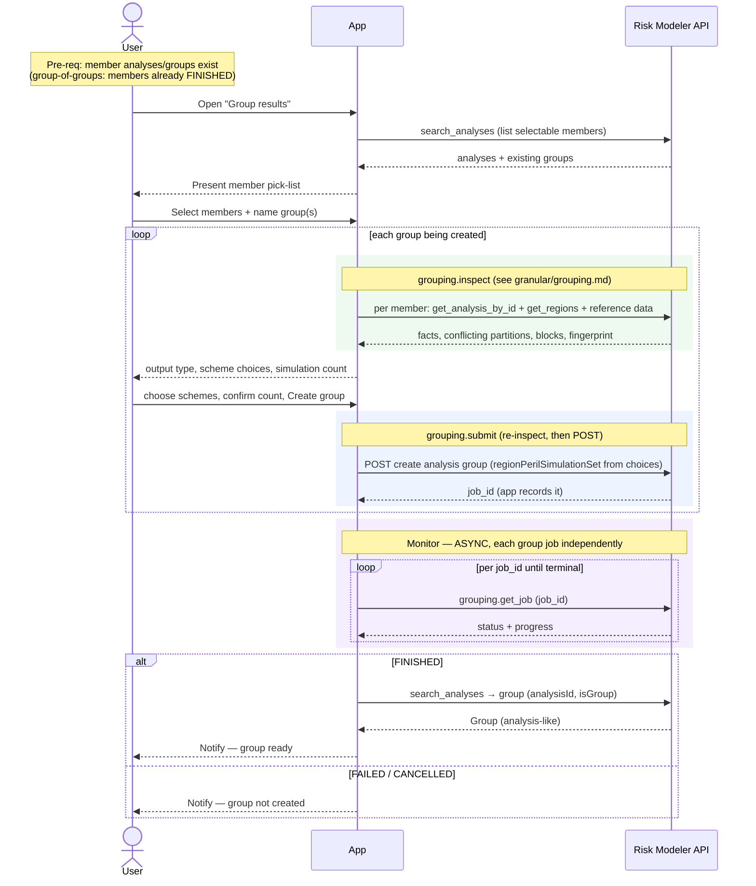

# Composite Flow — Group Results

The analyst's UI action for combining existing analyses (and/or existing groups)
into a new analysis group — e.g. an "all-perils" roll-up, or grouping by region.
The analyst picks the members from their existing results, names the group, and
submits. A group **is itself an analysis** in Risk Modeler, so the product feeds
straight back into View Results and Export like any other analysis.

**Composed of:**
- `granular/grouping.md` — `grouping.inspect(analysis_ids)` → user choices →
  `grouping.submit(...)` (async) → poll `grouping.get_job` per job.
- A `search_analyses` **read** to populate the member pick-list.
- If several groups are created in one action, the app **loops the single submit**
  per group (single-endpoint rule — one independent job each).

**Classification:** **async Job** per group (usually one). Not heavy in bytes, but
inspection and submit are each **read-fan-out heavy** (several RM reads per
member). Multiple groups = app-orchestrated loop of singles.

Pre-requisites:
- The member analyses/groups exist and their Platform analysis ids are known to
  the app.
- For a group-of-groups, the member groups have already **finished** (a group can
  only be grouped once it exists as an analysis).

**Definition:**

1. **Open grouping** — User opens "Group results" for a portfolio/EDM. The app lists
   the selectable analyses/groups (`search_analyses`) so the analyst can pick members.
2. **Select members + name** — User selects the member analyses/groups and names the
   new group. (Optionally the analyst defines more than one group in one action —
   e.g. one per region.)
3. **Inspect** — The app calls `grouping.inspect(analysis_ids)` per group and shows
   the output type, the partitions whose event-rate schemes conflict (with the
   members' schemes on offer), and any blocking problems. The user picks one scheme
   per conflicting partition and confirms the simulation count. A blocked set stops
   here.
4. **Submit** — User clicks "Create group". The app calls the single
   `grouping.submit(analysis_ids, settings, event_rate_selections,
   expected_inspection_fingerprint)` per group being created (looping the single
   submit if several), capturing each `job_id`. Each submit (see
   `granular/grouping.md`) re-inspects, rejects a changed fingerprint or a block
   before any POST, then `POST`s the group → `job_id`.
5. **Monitor (async, independent)** — poll `grouping.get_job(job_id)` per group
   until terminal.
6. **On FINISHED** — the group exists as an analysis-like entity (`analysisId`,
   `isGroup`), resolvable via `search_analyses` by its unique name and readable
   through View Results / exportable like any analysis.

**Sequence Flow:**

---

**Boundaries worth noting** (candidates for metamodel bounding boxes — observations, not decisions):

- **The product is just another analysis.** A group is stored as an analysis
  (`isGroup`) and is read, viewed, and exported identically. This composite therefore
  produces nothing structurally new — it feeds `view_results.md` and
  `export_to_loss_repo.md` with the same shape as `submit_analyses.md`. Strong signal
  that "analysis" and "group" are **one entity type**, and that grouping is another
  way to *make* an analysis, not a separate kind of thing to model.
- **Group-of-groups is a sequencing gate.** A group can only be grouped once it
  exists, so building a hierarchy in one sitting means the member groups must have
  finished first — the same "finished, not merely submitted" dependency seen in
  EDM→RDM. Usually this plays out across separate actions rather than one click.
- **Multiple groups follow the single-endpoint rule.** If the analyst defines several
  groups at once, the app loops the single submit and captures each `job_id` — no
  plural helper — so a failure in one group doesn't abort or orphan the others.
- **Inspection is a user-facing step.** The scheme for a conflicting partition is
  the analyst's choice, so the composite shows the inspection before it can submit,
  and the fingerprint ties the submit to what the analyst saw.
