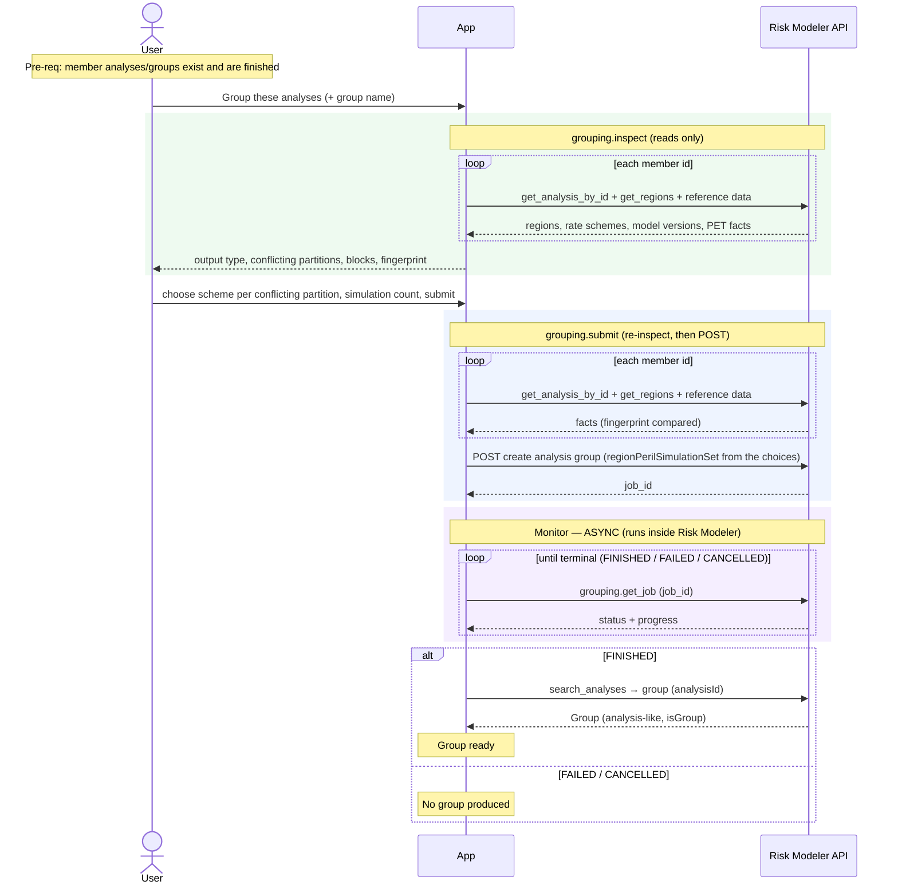

# Granular Flow — Grouping Analyses

Combines existing analyses (and/or existing groups) into a new analysis group,
tracked to completion. In Risk Modeler a group **is itself an analysis** (stored
with an engine/`isGroup` marker), so groups can contain groups.

`irp-integration`: `grouping.inspect(analysis_ids)` (reads only) →
`grouping.submit(analysis_ids, settings, event_rate_selections,
expected_inspection_fingerprint)` → (async) `grouping.get_job(job_id)`. Members
are Platform analysis ids. Inspection reads each member (`get_analysis_by_id`,
`get_regions`) plus model-version, event-rate-scheme, and PET reference data,
and returns the partitions whose event-rate schemes conflict, the output type
(ELT or PLT), any blocking problems, and a fingerprint of the facts.

**Classification:** async **Job**. Not heavy in bytes, but inspection is
**read-fan-out heavy** (several RM reads per member), and the submit repeats
it.

Pre-requisites:
- The member analyses/groups exist, are finished, and their Platform ids are
  known to the app.

**Definition:**

1. User selects analyses/groups to combine and names the new group.
2. App calls `grouping.inspect(analysis_ids)`:
   1. RM: per member, `get_analysis_by_id` + `get_regions` + reference-data
      lookups (model version, event-rate scheme, PET metadata for PLT members).
   2. Returns members, output type, partitions (with
      `event_rate_selection_required` and the schemes on offer), blocking
      problems, and a fingerprint. Nothing is created.
3. App shows the result. The user picks one scheme per conflicting partition
   (limited to the members' schemes), confirms the simulation count, and
   submits. A blocked member set stops here.
4. App calls `grouping.submit(...)` with the choices and the fingerprint:
   1. RM: the same inspection again. A changed fingerprint or a blocking
      problem raises `IRPGroupingValidationError` before any POST.
   2. RM: `POST` create analysis group with `regionPerilSimulationSet` built
      from the choices → returns the **`job_id`** (Location header) and the
      exact request body.
5. **Monitor (async)** — poll `grouping.get_job(job_id)` until terminal
   (`FINISHED` / `FAILED` / `CANCELLED`), tracking `progress`.
6. On `FINISHED`, the group exists as an analysis-like entity (`analysisId`),
   resolvable via `search_analyses` by its unique name.

**Sequence Flow:**

---

**Boundaries worth noting** (candidates for metamodel bounding boxes — observations, not decisions):

- **A group is an analysis.** The output is stored as an analysis (with an
  `isGroup` / `Group` engine marker) and can itself be a member of another group
  (group-of-groups). Whatever represents "analysis" and "group" is likely **one
  entity type**, not two — a real modelling decision this flow surfaces.
- **Inspection is a user-facing step.** The event-rate scheme for a conflicting
  partition is the analyst's choice, so the app has to show the inspection
  result before it can submit; the fingerprint ties the submit to what the
  analyst saw.
- **Read-fan-out at inspect and submit, not bytes.** Both calls make several RM
  reads per member; the submit can still fail before the job exists.
- **Members are Platform ids.** Analysis names duplicate tenant-wide, so the app
  must store each analysis's Platform id to hand it in.
