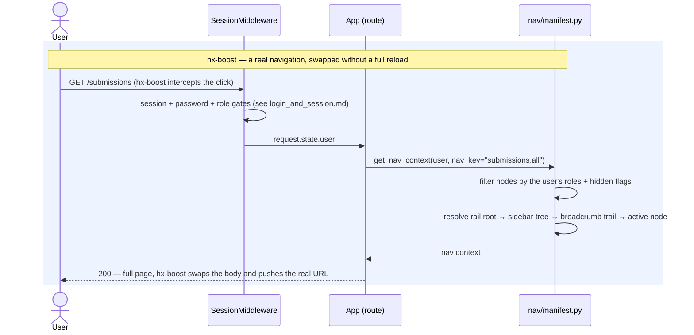
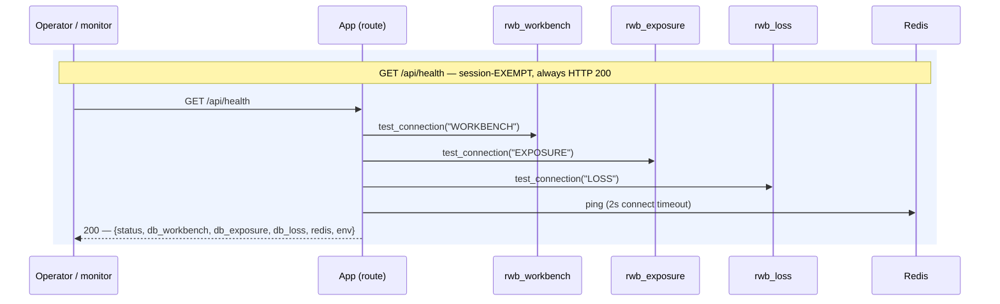

# Execution Flow — Navigate the Shell & Check Health (001 US6 / US7 / US8)

The frame every other flow renders inside, plus the one operational endpoint.

Navigation is **manifest-driven**: `app/nav/manifest.py` is the single source of truth for the
icon rail, the contextual sidebar, breadcrumbs, active-state highlighting, role gating, and the
search index. Adding a page is one manifest entry + one route + one template — there is no nav
config scattered across templates.

Code: `app.nav.manifest.NODES` → `get_nav_context(user, nav_key)`; `shell.*` page handlers;
`health.health`.

**Classification:** entirely **sync**, read-only. No RM call, no `rwb_job`, no worker, no poller,
and — apart from the health probe — no database read of its own.

## Records read (none written)

Nothing. The manifest is a Python constant; nav rendering touches no table. The only reads in this
document are the health probe's connection tests, which read nothing and return only reachability.

## Sequence — navigating

Because the URL is pushed and the handler renders a complete page, the address bar is always
truthful: reload, bookmark, and Back all work, and deep links land on the right page with the
right sidebar open. That is the constraint that rules out a SPA (Article 8) — `hx-boost` for
top-level nav, HTMX fragments for in-page updates, Alpine.js only for small client-side slivers
like the treaty expand/collapse.

## Sequence — the health probe

Each check degrades to `"error: <ExceptionType>"` rather than raising, and the endpoint returns
**200 even when a dependency is down** — the response *body* carries the verdict. Deliberate: a
monitor should be able to tell "the app is up but Redis is unreachable" apart from "the app is
down", and a health check that 500s tells you neither. No credentials, no stack traces.

## Not built yet

Six shell pages are **empty stubs** — a single "… will appear here" paragraph:

| Route | Status |
|---|---|
| `/workflows/active`, `/workflows/review`, `/workflows/exceptions` | stub |
| `/workflows/irp-jobs`, `/workflows/rwb-jobs` | stub |
| `/results`, `/templates` | stub |

They exist because the manifest owns the nav tree and the nodes were created in 001; the pages
behind them were descoped (003 US6) or belong to later iterations. **`/workflows/rwb-jobs` and
`/workflows/irp-jobs` are the two that matter most** — they are where an analyst would go to see
why a job failed, and today there is nowhere.

One genuine gap: the shell's global search box posts to **`hx-get="/api/search"`, and no such
route exists** — every keystroke 404s. The manifest already carries `searchable` flags and
exposes `searchable_nodes()` for it; only the endpoint is missing.

---

**Boundaries worth noting**

- **The manifest is the source of truth, and it's a constant, not a table** (Article 1). Nav
  structure is code-reviewed and versioned with the app rather than being data an admin can
  reshape at runtime. The cost is that adding a page needs a deploy; the benefit is that
  breadcrumbs, role gates and active-state can never drift from the routes.
- **Role gating in the manifest hides *links*; the routes gate themselves.** A node's `roles`
  list keeps it out of the rail and sidebar, but the actual authorisation is server-side in the
  handler (`_require_admin` and friends). Hiding a link is presentation, not security.
- **`/api/health` is deliberately session-exempt**, registered before the session middleware so a
  monitor needs no credentials. It reports reachability only — never row counts, never config
  values beyond the environment name.
- **It probes all three databases even though the app only uses one today.** `rwb_exposure` and
  `rwb_loss` are otherwise untouched by `app/` — every write in every flow in this set lands in
  `rwb_workbench`. The probe is forward-looking, and it is the only reason those connections are
  configured at all.
- **DATABRIDGE is not in the probe.** It is read-only, worker-side, and reached through the
  `irp-integration` wheel rather than the `db/` package (Article 11), so it has no
  `test_connection` name. Its availability surfaces per-job instead, as
  `output_data.summary = "unavailable"` — see
  [backfill EDM detail](../backfill/backfill_edm_detail.md).
