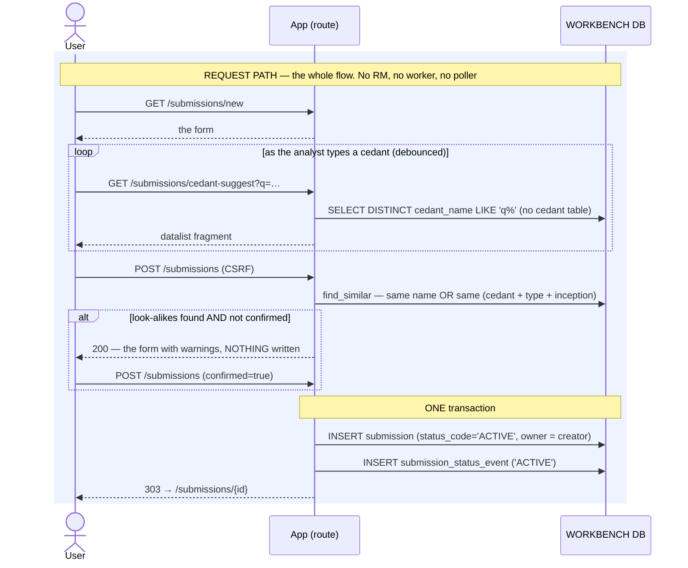

# Execution Flow — Register a Submission (002 US1 / US5)

The analyst registers an incoming deal: name, cedant, treaty type, inception date, treaty
year, the deal's directory path, an optional renewal link to last year's submission. The
creator becomes its owner.

**Purely workbench.** Risk Modeler has no concept of a submission — it never learns the deal
name or the cedant — so this flow touches no external system at all. It writes two rows in one
transaction and returns.

Code: `submissions.create` → `submission_service.create_submission` (which calls
`find_similar` first); the cedant typeahead is `submission_service.cedant_suggestions`.

**Classification:** entirely **sync**. No RM call, no `rwb_job`, no worker, no poller.

## Records written (in order)

| # | Table | Row / change | Written by | Process |
|---|---|---|---|---|
| 1 | `submission` | INSERT — `status_code='ACTIVE'`, `assigned_analyst_id = the creator` | `create_submission` | 🟦 request |
| 2 | `submission_status_event` | INSERT — the initial `ACTIVE` event, `reason=NULL` | `create_submission` | 🟦 request |

**Both commit in one transaction** (R2). That is Article 4 in miniature: `submission.status_code`
is a *cached* value and `submission_status_event` is the truth, so a submission may never exist
without its opening event.

## The look-alike check writes nothing

Before either insert, `find_similar` looks for deals matching on **either**:

- the same `name`, **or**
- the same `(cedant_name, treaty_type_code, inception_date)` triple.

If it finds any and the analyst hasn't confirmed, the service returns `created=False` with the
matches and **writes nothing**. Re-posting with `confirmed=true` proceeds. Deal identity is
deliberately **not unique** (FR-004/US5) — genuine look-alikes coexist in this business, so the
check is a warning, never a constraint.

## Sequence

---

**Boundaries worth noting**

- **A submission exists only in our world.** Risk Modeler has no such concept: it will only
  ever see the *names of the EDMs and RDMs* the analyst later attaches. Something had to own
  "these imports belong to one deal", and this is it — which is why the submission is the
  association rows rather than anything in Risk Modeler.
- **The cedant list is derived, not curated.** There is no cedant table; the typeahead is a
  `DISTINCT` over what's already been typed. Cheap and self-maintaining, at the cost of
  propagating a typo until someone fixes it.
- **Duplicate deals are legal.** The identity check is advisory by design. Anything that later
  wants "the submission for this deal" must not assume there is exactly one.
- **The creator is the owner, and the owner is not a permission.** `assigned_analyst_id` drives
  the "My submissions" filter and nothing else — every authenticated analyst can act on every
  submission (Article 6). See [find submissions](find_submissions.md).
- **Nothing is enqueued.** Registering a deal starts no background work; the first job appears
  only when an EDM or RDM import begins.
