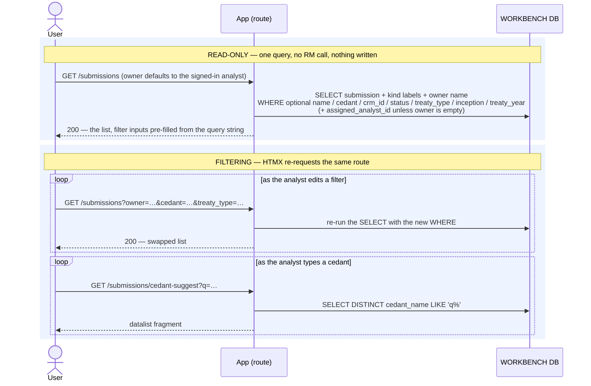

# Execution Flow — Find & Filter Submissions (002 US2)

One list, `/submissions`, filtered by owner. The Owner filter defaults to the signed-in
analyst — the working default — and switches to another analyst or to every owner. Name,
cedant, CRM ID, status, treaty type, inception date and treaty year filter alongside it,
applied as you type via HTMX.

**Purely workbench, read-only.** One query, no RM call, nothing written.

Code: `submissions._list_page` → `submission_service.list_submissions`;
the cedant typeahead is `submission_service.cedant_suggestions`.

**Classification:** entirely **sync**, read-only.

## Records read (none written)

| # | Query | Source rows |
|---|---|---|
| 1 | the rows: header fields + joined kind labels + the owner's display name, `ORDER BY inception_date DESC, name` | `submission` + LEFT JOIN `treaty_type_kind`, `submission_status_kind`, `app_user` |
| 2 | cedant prefix matches, for the filter's datalist | `SELECT DISTINCT cedant_name FROM submission WHERE cedant_name LIKE 'q%'` |

Filters are AND-combined onto query 1. `owner_id` comes from the `owner` query parameter:
absent passes the current user, empty passes `None`, an `app_user.id` passes that analyst.

Filter values are echoed back into the response so the inputs keep their state across HTMX
swaps.

## Sequence

---

**Boundaries worth noting**

- **The owner is a filter, not a permission** (Article 6 / FR-019). It matches
  `assigned_analyst_id`, which is a soft ownership label — every authenticated analyst can open
  and act on every deal, including ones the All list shows them that they don't own. There is no
  `customer_id`, no `apply_scope`, and no row-level gate anywhere in this query.
- **The default view is the narrow one.** The nav points at `/submissions`, which applies the
  analyst's own id, so the common case is small; picking "Any owner" covers hand-offs. That's a
  UX choice with no security meaning.
- **Nothing here is polled.** Unlike the [entity libraries](../entities/browse_libraries.md),
  the submission list has no live-refresh — a submission's own state doesn't change from
  background work, only from someone acting on it.
- **Ordering is by inception date, newest first**, which is how analysts actually think about
  the book — not by creation time.
- **The name/text narrowing is client-side.** It filters the rows already rendered rather than
  re-querying, so it can't page in matches that weren't in the result set. The four real filters
  are the ones that hit the database.
