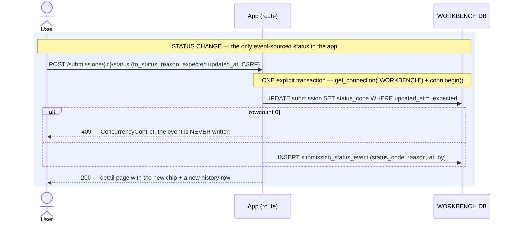
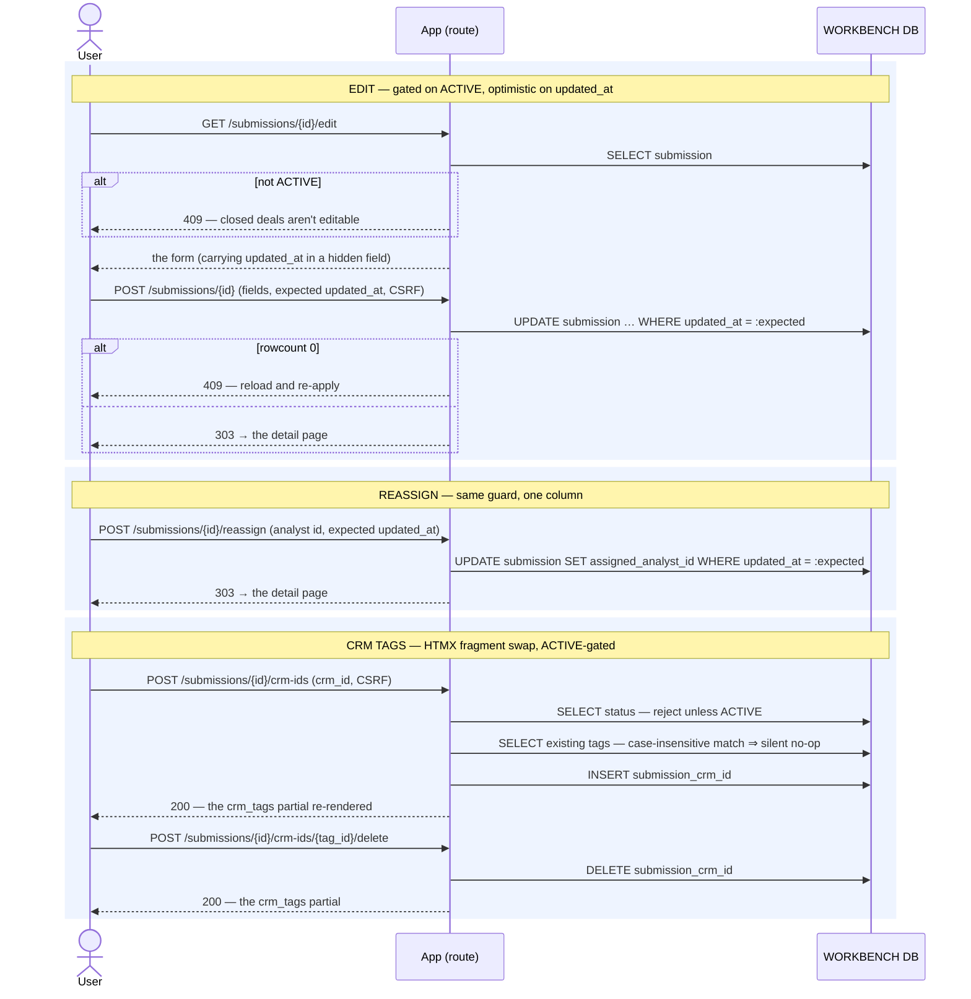

# Execution Flow — Manage a Submission (002 US3 / US4 + edit & reassign)

Four small mutations on an existing deal, grouped because they share one shape — optimistic
concurrency on the request path, no external system, no background work:

1. **Edit** the deal's fields (`POST /submissions/{id}`)
2. **Reassign** its owner (`POST /submissions/{id}/reassign`)
3. **Change status** — ACTIVE / COMPLETED / CANCELLED (`POST /submissions/{id}/status`)
4. **Add / remove CRM-ID tags** (`POST …/crm-ids`, `POST …/crm-ids/{tag_id}/delete`)

The status change is the one that matters architecturally: it is the **only event-sourced status
in the entire system** (Article 4), and the only place in this diagram set where you see the
insert-event-and-stamp-the-cache pattern.

Code: `submission_service.update_submission` / `reassign_owner` / `set_status` /
`add_crm_id` / `remove_crm_id`.

**Classification:** all four entirely **sync**. No RM call, no `rwb_job`, no worker, no poller.

## Records written

| Action | # | Table | Row / change | Process |
|---|---|---|---|---|
| Edit | 1 | `submission` | UPDATE the mutable fields **`WHERE updated_at = :expected`** → `rows == 0` raises `ConcurrencyConflict` | 🟦 request |
| Reassign | 1 | `submission` | UPDATE `assigned_analyst_id`, same optimistic guard | 🟦 request |
| **Status** | 1 | `submission` | UPDATE `status_code` (the **cached** current) **`WHERE updated_at = :expected`** | 🟦 request |
| **Status** | 2 | `submission_status_event` | INSERT — `status_code`, optional `reason`, `at`, `inserted_by` — **same transaction as 1** | 🟦 request |
| Add tag | 1 | `submission_crm_id` | INSERT — free text, whitespace-trimmed; a case-insensitive duplicate is a **silent no-op** returning the existing id | 🟦 request |
| Remove tag | 1 | `submission_crm_id` | DELETE the tag row | 🟦 request |

## Status: the event and the cache commit together

The ordering is deliberate: the concurrency check fires **before** the event insert, so a lost
race cannot leave an event without its cache stamp or vice versa. There is **no state machine** —
any transition is legal (FR-012), reopening a closed deal is an ordinary transition (FR-011), and
setting the status it already has is a *recorded* no-op rather than an error.

**There is no delete** (FR-014). CANCELLED is how a deal goes away, and the history keeps every
transition with its reason and its author, newest first.

## Edit, reassign, tags

---

**Boundaries worth noting**

- **`submission.status_code` is a cache; `submission_status_event` is the truth** (Article 4).
  Every other status column in the app — `irp_edm.status`, `irp_rdm.status`, `rwb_job.status_code`,
  `irp_job.status` — is updated **in place** with no event log. This is the single exception, and
  the reason is auditability: an underwriter needs to know when a deal was closed, by whom, and
  why.
- **Optimistic concurrency is the pattern for every in-place mutation here**, and the check *is*
  the write: `WHERE updated_at = :expected`, `rowcount == 0` → 409. No SELECT-then-UPDATE, so
  there is no window between checking and writing. The same idiom appears in
  [replace-file](../entities/recover_import.md).
- **The ACTIVE gate is a workflow rule, not an access rule.** Editing and tagging require an
  ACTIVE deal; *viewing* never does, and *any* analyst may edit an ACTIVE deal they don't own
  (Article 6).
- **Tags are free text with no format validation**, deduped case-insensitively. CRM IDs come from
  a system we don't control, so validating their shape would be inventing a constraint.
- **There is no tag *edit* path** — it was implemented and then deliberately removed
  (commit `eb76218`). Remove-and-re-add is the intended edit, which keeps the table append-only
  in practice.
- **Nothing here enqueues work or reaches Risk Modeler.** A submission's own lifecycle is pure
  workbench state; the background machinery only ever engages through
  [entity imports](../entities/import_edm.md).
