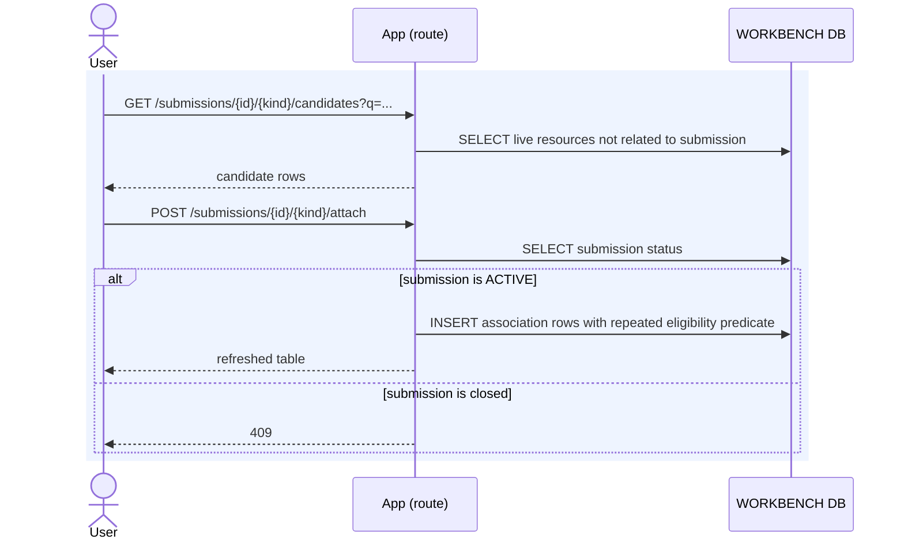
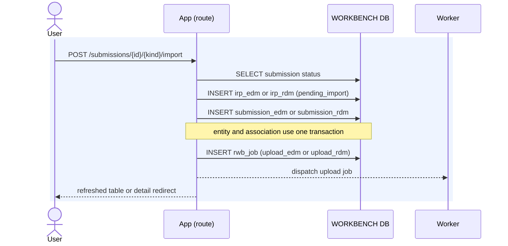
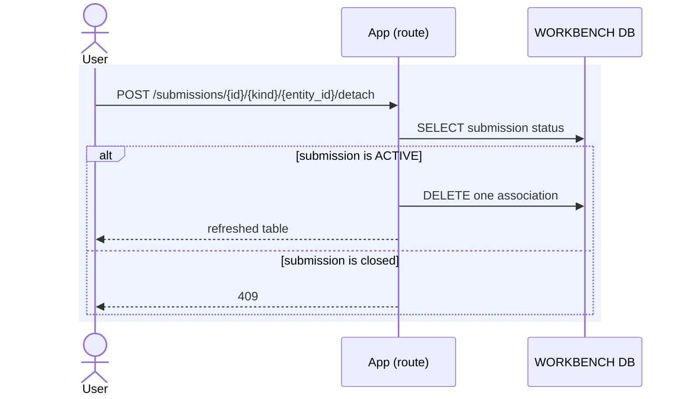

# Execution — Manage Submission Data

An analyst can import a new EDM or RDM, relate an existing EDM or RDM, or remove
one association. Only an active submission accepts these changes.

Code: `app.routers.submissions` and `app.services.submission_service`, with new
imports delegated to `edm_service.import_edm` or `rdm_service.import_rdm`.

## Add an existing EDM or RDM

Candidate reads select every live resource that has no association to the named
submission. The POST repeats the predicate so a stale selection cannot create an
invalid association. Adding an existing resource makes no Risk Modeler call and
does not enqueue a job.

## Import a new EDM or RDM

The resource row and association row are inserted in one transaction. The upload
job is then enqueued with `requested_from_submission_id` as provenance. EDM and RDM
imports continue through their entity-specific worker and poller processing.

## Remove an association

Removal deletes only `submission_edm` or `submission_rdm`. The resource, its other
submission associations, its stored detail, and its Risk Modeler resource remain.

