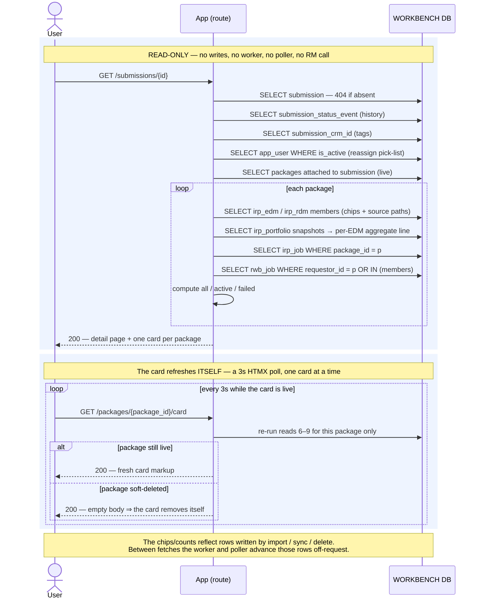

# Execution Flow — View a Submission (002 detail + 003 US5)

The read side, and the app's busiest page. Opening a submission assembles everything about
the deal in one context: the submission header, its event-sourced status history, its CRM-ID
tags, the analyst pick-list for reassignment, and **one package card per attached package**
— each member's own status chip, its source path, its per-EDM aggregate line, and the
**all / active / failed** job counts for that package's work.

This is where the analyst *sees* the progress the worker and poller are driving. Every other
flow in this set writes rows; this one reads them.

Code: `submissions._detail_context` → `submission_service.get_submission` /
`get_status_history` / `list_crm_ids` → `package_sync_service.get_package_cards` →
`get_package_card(with_counts=True)` → `job_query.package_job_counts`.

**Classification:** entirely **sync**, entirely read-only. No `rwb_job`, no `irp_job`, no
entity mutation, no worker, no poller, and **no Risk Modeler call** — the page renders from
the workbench only.

## Records read (none written)

| # | Query | Source rows |
|---|---|---|
| 1 | the submission header | `submission` (404 when absent) |
| 2 | status history — every transition | `submission_status_event` |
| 3 | CRM-ID tags (0..n) | `submission_crm_id` |
| 4 | the analyst pick-list for the reassign control | `app_user WHERE is_active = 1` |
| 5 | packages attached to the submission (live only) | `package` ⋈ `submission_package`, `deleted_at IS NULL` |
| 6 | per package: live members + their status chips + source paths | `irp_edm`, `irp_rdm` where `package_id`, `deleted_at IS NULL` |
| 7 | per package: per-EDM aggregate line (004 US4) | `irp_portfolio.exposure_detail` snapshots, rolled up in Python |
| 8 | per package: `irp_job` rows at the package grain | `irp_job WHERE package_id = :p` |
| 9 | per package: `rwb_job` rows for the package or any member | `rwb_job WHERE requestor_id = :p OR requestor_id IN (members)` |

The counts are computed in Python from 8 + 9:

- **all** = `len(irp) + len(rwb)`
- **active** = `irp` not in the terminal set **+** `rwb` in `('pending','running')`
- **failed** = `irp` in `('FAILED','CANCELLED','SUBMISSION FAILED')` **+** `rwb` = `'failed'`

There is deliberately **no rolled-up package status** (FR-018) — each member carries its own
chip; the card shows counts, not a single package verdict.

## Sequence

---

**Boundaries worth noting**

- **This is the only user action in the set with zero writes and no off-request work.** It
  is the mirror of the others: import / sync / delete *produce* the `rwb_job` / `irp_job` /
  entity rows; this page *reads* them.
- **The counts union both job tables** because the two halves of every operation live in
  different tables — the app-side queue (`rwb_job`) and the RM-op bridge (`irp_job`) — and
  each has its own terminal vocabulary. `job_query` owns that union so neither write-service
  leaks into the read path.
- **Progress appears by re-fetching, not by push.** The card is re-requested (HTMX) and
  re-runs these reads; between fetches the worker and poller are advancing the underlying
  rows off-request. There is no websocket and no server push — the read is cheap and
  idempotent.
- **The card's poll is scoped to one package; the rest of the page isn't polled at all.**
  Only `GET /packages/{id}/card` re-fetches — the header, history and tags are static until
  the analyst acts. That is what keeps a 3-second cadence cheap.
- **The job-count numbers deep-link to a page that doesn't exist yet.** They point at
  `/workflows/irp-jobs?package=…&status=active|failed`, which is still an empty stub —
  003 US6 (the filterable jobs list) was descoped. The counts themselves are real; only the
  drill-through is missing.
- **Read scope is unrestricted (Article 6).** No `customer_id`, no `apply_scope` — every
  analyst sees every submission and every package's counts. The read-only *gates* enforced
  elsewhere (`_package_actionable`, `_submission_active`) govern whether the **action
  buttons** render, not whether the page is visible.
- **`assigned_analyst_id` is an owner label, not a permission.** It drives the "My
  submissions" filter and nothing else — see [find submissions](find_submissions.md).
