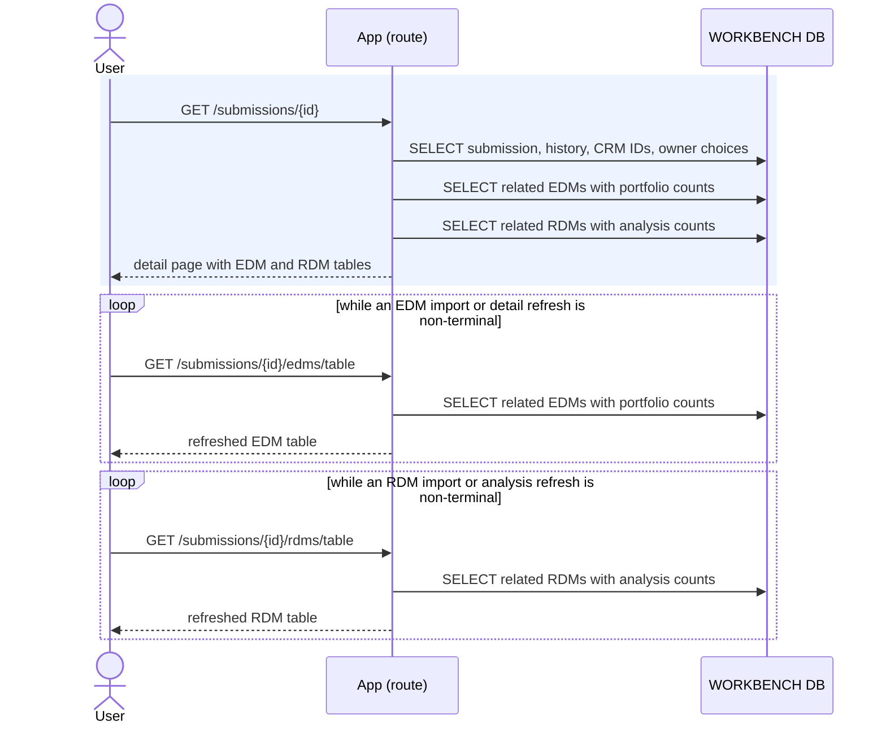

# Execution — View a Submission

Opening a submission renders the submission header, status history, CRM IDs, owner
controls, portfolios, treaties, and separate EDM and RDM tables. The request reads
only WORKBENCH data and makes no Risk Modeler call.

Code: `submissions._detail_context`, `submission_service.get_submission`,
`list_submission_edms`, `list_submission_rdms`, `get_status_history`, and
`list_crm_ids`.

## Rows read

| Query | Tables |
|---|---|
| Submission header | `submission` |
| Status history | `submission_status_event` |
| CRM IDs | `submission_crm_id` |
| Owner choices | `app_user` |
| Related EDMs and portfolio counts | `submission_edm`, `irp_edm`, `irp_portfolio` |
| Related RDMs and analysis counts | `submission_rdm`, `irp_rdm`, `irp_analysis` |

Each table emits its own HTMX polling trigger only while a listed import or later
detail refresh is non-terminal. A terminal table response omits the trigger.

EDM names link to `/submissions/{submission_id}/edms/{edm_id}` so the selected
submission remains explicit. RDM names link to the direct RDM detail route.
